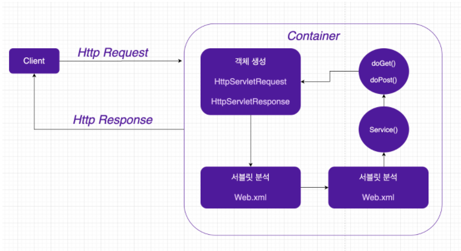
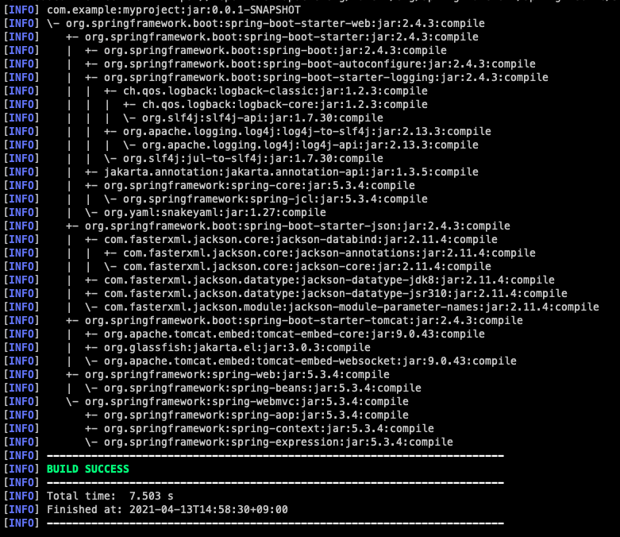
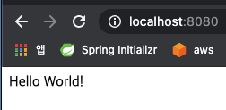

# Getting Started

`해당 문서는 Spring boot 공식 문서를 읽고 공부한 내용입니다 원본은 아래의 링크를 클릭 !`  
[Using Spring Boot](https://docs.spring.io/spring-boot/docs/2.4.3/reference/html/index.html)


## 공식문서가 소개하는 **Spring Boot 의 목적**
스프링 부트를 사용하면,

 1. 스프링을 이용한 개발을 빠르게 시작할 수 있다.
 1. 기본 설정으로 바로 사용하면 된다. (권장하는 방법, Be opinionated out of the box) 하지만 기본 설정과 다른 요구사항이 있다면, 빠르게 변경하여 사용하면 된다.
 1. 큰 프로젝트에서 비 기능적 특징들을 제공한다. (임베디드 서버, 보안, 측정, 헬스 체크, 외부 설정 등)
 1. 마지막으로 제일 중요한 것은, Spring 과 달리 코드 생성이나 XML 설정이 필요 없다.
 
## 시스템 요구사항
 - Java 8 버전 이상
 - Spring Framework 5.3.4 버전 이상.
 - 빌드 도구
    - Maven : 3.3 이상
    - Gradle : 6.3.x 이상
 - servlet Container
    - Tomcat 9.0
    - Jetty 9.4
    - Undertow 2.0
    
> Servlet  
> Web 프로그래밍에서 Client 의 요청 (request) 를 처리하여
> Client 에게 응답 (response) 하는 기술.  
> javax.servlet.Servlet 인터페이스의 구현체이며, 클래스이다.  
> javax.servlet.http.HttpServlet 이 보통 말하는 http 요청의 서블릿 구현체이다.  
> init(), service(), destroy() 메서드로 생명주기가 관리된다.

> Servlet Container  
> 서블릿의 생성, 실행, 파괴를 담당하는 서블릿 상자  
> Web Server (Tomcat, Jetty ..) 에 포함된다.
> 웹서버가 요청을 받으면, 서블릿 컨테이너로 전달하고, 서블릿 컨테이너는 적절한 서블릿에게 작업을 전달한다.

> 서블릿 생명주기
>
> 
> 1. 사용자 요청
> 1. 서블릿 컨테이너에서 HttpServletRequest, HttpServletResponse 객체 생성
> 1. Web.xml(DD. Deploy Descriptor, 배포 서술) 을 참고하여 어떤 서블릿에 대한 요청인지 찾는다.
>   1. 서블릿이 처음으로 요청된경우에는 서블릿 클래스를 메모리에 로딩하여 객체를 생성 한다. 생성된 객체는 메모리에 계속 존재하므로 이후부터는 서블릿 객체가 새로 생성되지 않고, 메모리에 있는 서블릿 객체로 사용한다.
>   1. init() 로 서블릿을 초기화한다.
> 1. 해당 서블릿의 service() 메서드를 실행한다.
>   1. service() 는 요청에 따라 doGet() 또는 doPost() 메서드를 호출하게 된다.
>   1. 우리는 보통 이 doGet(), doPost() 를 오버라이딩하여 적절한 처리를 하게 된다.
> 1. 처리가 끝나면 HttpServletResponse 에 결과를 전달한다.
> 1. 사용자에게 응답을 전달하고 HttpServletRequest, HttpServletResponse 객체를 소멸시킨다.


<br>
<br>
<br>

## 설치

 - 스프링 부트는 표준 자바 라이브러리처럼 사용할 수 있다.
 - 라이브러리를 프로젝트에 적용시키기 위해서는, jar 파일 (spring-boot xxx) 를 가져와서 classpath 로 적용시키는 일을 해야한다.
 - 일일이 jar 파일을 복사할 수 있겠지만, 우리는 `빌드도구` 라는 것을 주로 사용한다.

### 빌드도구
 1. 애플리케이션 빌드
    - 애플리케이션을 컴파일하고 실행 가능한 상태로 프로그램을 완성한다.
 1. 프로그램 테스트와 실행
 1. 라이브러리 관리
    - 빌드 파일에 명시된 라이브러리를 자동으로 다운로드 받고, classpath 에 포함시킨다.
    - mavenCentral 과 같이 의존성 라이브러리들을 모아서 관리해주는 중앙저장 웹서비스를 이용한다.
 1. 배포작업

> 이러한 빌드도구를 사용해도 라이브러리간의 충돌 문제는 빈번하게 발생하는데,  
> Spring-boot-starter, Spring-boot-starter-parent 로 시작하는 라이브러리들은  
> 그에 필요한 (충돌없는 적절한) 라이브러리들을 한데 묶어서 미리 선언해놓음으로서  
> 적절한 [라이브러리들의 조합] 을 제공한다. 
 
 #### Gradle
 - build.gradle 파일에 라이브러리 의존성을 기입한다.
 - `org.springframework.boot` `group` 형식으로 기입한다.
 - JVM 기반 스크립트 언어 groovy 로 만들어졌다.
 - 스크립트 기반 언어이기 때문에 컴파일이 필요 없다.
 
 > gradle wrapper : gradlew  
>
> Gradle Wrapper 는 gradle 을 따로 설치하지 않아도 되는 방법을 제공한다.
> 프로젝트 내에 필요한 gradle 버전을 선언한다.  
> 빌드시 환경에 해당 gradle 이 필요하다면 자동으로 다운받는다.  
> 환경에 종속되지 않고 빌드를 할 수 있다.
 

<br>
<br>
<br>

## Spring Boot migration 하기
 - spring boot 2 는 2018 년 2월 출시되었다.
 - spring boot 1.x 버전과의 차이점은 아래와 같다.
    1. 최소 Java 8 부터 지원
    1. Java 9 를 지원하기 시작
    1. 그 외 Tomcat, Hibernate, Gradle 등 최소 버전이 상향.
    1. Spring security 의 설정이 쉬워짐
    1. 리엑티브 프로그래밍을 지원.
    1. 많은 properties 이름이 변경 / 제거됨 -> migration 의 필요성
    1. 등등
 - `org.springframework.boot:spring-boot-properties-migrator` 라이브러리를 의존성에 추가함으로서 마이그레이션이 가능.
 - 현재는 1 버전에서 마이그레이션을 할 일은 없지만, 2 에서 3을 가는 시점이 오거나 만에하나 해야하는 일이 있을 수 있다.
 - [여기](https://github.com/spring-projects/spring-boot/wiki/Spring-Boot-2.0-Migration-Guide) 서 가이드를 볼 수 있다.
 
<br>
<br>

## Developing Your First Spring Boot Application

### 1. Java, Maven 설치
 - (mac 기준) Maven 을 homebrew 로 설치하려면 xcode 가 설치되어야합니다.
```
sudo rm -rf /Library/Developer/CommandLineTools
sudo xcode-select --install
```

 - `brew install mvn` 명령어로 Maven 을 설치합니다.
 - `java -version`, `mvn -v` 명령어로 설치를 확인합니다.
 


### 2. pom.xml 을 작성합니다.


```xml
<?xml version="1.0" encoding="UTF-8"?>
<project xmlns="http://maven.apache.org/POM/4.0.0" xmlns:xsi="http://www.w3.org/2001/XMLSchema-instance"
    xsi:schemaLocation="http://maven.apache.org/POM/4.0.0 https://maven.apache.org/xsd/maven-4.0.0.xsd">
    <modelVersion>4.0.0</modelVersion>

    <groupId>com.example</groupId>
    <artifactId>myproject</artifactId>
    <version>0.0.1-SNAPSHOT</version>

    <parent>
        <groupId>org.springframework.boot</groupId>
        <artifactId>spring-boot-starter-parent</artifactId>
        <version>2.4.3</version>
    </parent>

    <description/>
    <developers>
        <developer/>
    </developers>
    <licenses>
        <license/>
    </licenses>
    <scm>
        <url/>
    </scm>
    <url/>

    <!-- Additional lines to be added here... -->

</project>

```

### 3. web 의존성을 추가하고 의존성 tree 확인하기
 - `spring-boot-starter-web` pom.xml 에 추가
 - `mvn dependency:tree` :  pom.xml 에 선언되어 있는 의존성 라이브러리들의 트리 구조를 확인
 

### 4. 코드 작성
 - Maven 은 기본적으로 src/main/java 경로에서 소스파일을 컴파일 한다. 따라서 이 경로를 만들어준다.
 
 
 
 ```java
import org.springframework.boot.*;
import org.springframework.boot.autoconfigure.*;
import org.springframework.web.bind.annotation.*;

@RestController
@EnableAutoConfiguration
public class Example {

    @RequestMapping("/")
    String home() {
        return "Hello World!";
    }

    public static void main(String[] args) {
        SpringApplication.run(Example.class, args);
    }

}
```

 - 여기서 @EnableAutoConfiguration 는 `org.springframework.boot:spring-boot-sutoconfigure` 의 spring.factories 에 정의된 메타정보들을 빈으로 등록한다.
 - 아무 설정 없이 spring boot 를 사용할 수 있게 해준다.

### 에플리케이션 실팽
 - `mvn spring-boot:run` 로 실행가능
 - localhost:80080 에서 결과 확인
 
### 배포하기
 - 배포를 위해서는 완전한 jar (or war) 이 필요하다.
 - 빌드를 위해 pom.xml 에 다음 코드를 추가한다
 ```xml
<build>
    <plugins>
        <plugin>
            <groupId>org.springframework.boot</groupId>
            <artifactId>spring-boot-maven-plugin</artifactId>
        </plugin>
    </plugins>
</build>
```
 - 이후 `mvn package` 명령을 사용하여 패키징한다.
 - 패키징된 jar 파일을 `java -jar ` 명령을 통해 실과행한다.
 
 
 